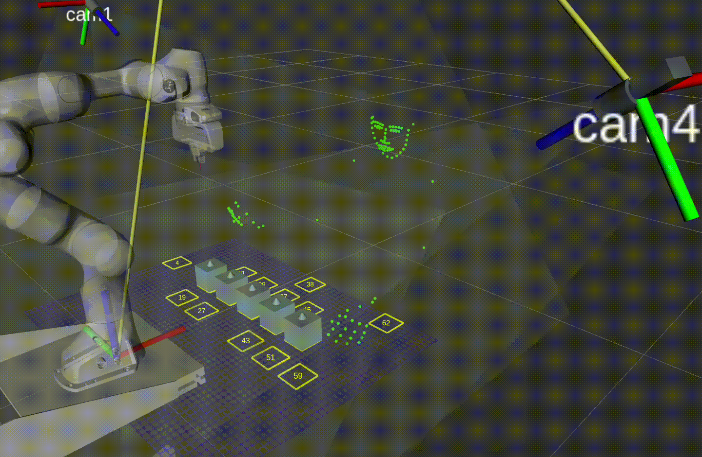
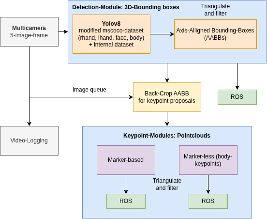

# Real-Time-3D-Tracking



Real-time multi-camera **3D tracking for human keypoints and objects**, implemented in C++ and integrated with ROS.

The package combines synchronized multi-camera acquisition, GPU-based 2D detection and pose inference, multi-view geometry, and temporal tracking to obtain 3D observations in real time.

It supports two main tracking modes:

* **133-keypoint human pose tracking**
* **Color-based marker/object tracking**

This module is part of the **ROS/ROS2 [real-time 3D tracker Docker implementation](https://github.com/HenrikTrom/ROSTrack-RT-3D)**, which provides the surrounding camera, inference, calibration, and Docker infrastructure.

---

## Overview

The tracking pipeline processes synchronized images from multiple calibrated cameras and reconstructs tracked features in 3D.

At a high level:

```text
Synchronized FLIR cameras
          │
          ▼
   Multi-camera images
          │
          ▼
   Object detection
          │
          ├───────────────┐
          ▼               ▼
  Bounding boxes     ROI / back-crops
                          │
                          ▼
                Keypoint / color tracking
                          │
                          ▼
                 Multi-view matching
                          │
                          ▼
                    Triangulation
                          │
                          ▼
                   3D ROS output
```

The implementation separates camera acquisition from detection/keypoint processing using worker threads and FIFO-based processing stages. The tracker can operate on live synchronized FLIR camera streams or recorded multi-camera videos.

---

## Features

* Real-time multi-camera processing
* Synchronized FLIR camera acquisition
* GPU-based detection and pose inference
* 133-keypoint human pose tracking
* Color-marker tracking
* Multi-view 3D triangulation
* ROS visualization output
* Online camera mode
* Offline synchronized-video mode
* Single-image inference benchmark/debug mode
* Optional video recording
* Camera-to-robot calibration support

The package currently builds the following executables:

| Executable            | Purpose                                      |
| --------------------- | -------------------------------------------- |
| `interface_133`       | Detection + 133-keypoint human pose tracking |
| `interface_color`     | Detection + color-based tracking             |
| `inference_benchmark` | Single-image/debug inference benchmark       |

---

## System Architecture

The main tracking interface is implemented by `TrackingInterfaceModule`.

At startup, it initializes the detection stage followed by the selected tracking stage. Depending on the executable, this is either the 133-keypoint tracker or color tracker.

Camera acquisition and inference processing execute asynchronously.

```text
                    TrackingInterfaceModule
                             │
              ┌──────────────┴──────────────┐
              │                             │
       Camera thread                 Processing thread
              │                             │
              ▼                             ▼
     synchronized frames               AABB output
              │                             │
              ▼                             ▼
        AABB detector              keypoint / color stage
                                            │
                                            ▼
                                      3D tracking
```

For live operation, `FlirCameraHandler` acquires synchronized frames and forwards them to the detection pipeline. Offline mode instead reads synchronized videos from the test input directory.

---

## Prerequisites

The recommended way to use this package is through the complete Docker environment:

[ROSTrack-RT-3D](https://github.com/HenrikTrom/ROSTrack-RT-3D)

The full system requires a calibrated multi-camera setup and, for the inference pipeline, a TensorRT-capable NVIDIA GPU.

The package itself uses:

* C++17
* ROS / Catkin
* OpenCV
* Eigen3
* TensorRT
* FLIR/Spinnaker camera infrastructure

and the project-specific dependencies:

* `cpp_utils`
* `detection_inference`
* `pose_inference`
* `flirmulticamera`
* `tensorrt-cpp-api`
* `ros_node_interface`
* `flir_icp_calib`

The Docker repository provides the intended environment for these dependencies.

---

## Calibration

Accurate 3D reconstruction requires calibrated cameras.

### 1. Multi-camera calibration

Calibrate the intrinsic and extrinsic parameters of the camera system using:

[multi-camera-calib](https://github.com/HenrikTrom/multi-camera-calib)

The resulting calibration describes the geometry of the multi-camera system and is required for triangulation.

### 2. Camera-to-robot calibration

For applications where tracking results must be expressed relative to a robot, the camera system can additionally be registered to the robot base frame using:

[flir_icp_calib](https://github.com/HenrikTrom/flir_icp_calib)

This step is optional for camera-only 3D tracking.

---

## Usage

### 133-keypoint human tracking

Launch the human pose tracking interface with:

```bash
roslaunch real_time_3d_tracking interface133.launch
```

This starts the `interface_133` executable.

The default namespace is:

```text
/flir_ros_interface
```

and the launch file automatically calls the tracker's `start` service.

To disable automatic startup:

```bash
roslaunch real_time_3d_tracking interface133.launch autostart:=false
```

### Color tracking

Launch the color-tracking pipeline with:

```bash
roslaunch real_time_3d_tracking interface_color.launch
```

This starts the `interface_color` executable.

---

## Online and Offline Operation

The tracker supports two input modes.

### Online

In online mode, synchronized frames are acquired directly from the FLIR camera system:

```text
FLIR cameras
     ↓
FlirCameraHandler
     ↓
GPU upload
     ↓
Detection
     ↓
Tracking
```

Camera parameters are loaded through the configured multi-camera settings.

### Offline

When online mode is disabled, the tracker reads synchronized video streams from:

```text
test/inputs/videos/
```

The videos are associated with individual cameras using their serial numbers.

This mode is useful for development, debugging, and reproducible experiments without requiring access to the physical camera system.

---

## Configuration

Compile-time constants are defined in:

```text
cmake/config.h.in
```

CMake generates:

```text
src/config.h
```

from this file during configuration.

Important defaults include:

```cpp
constexpr std::string_view TOPIC_AABB = "aabbs";
constexpr std::string_view TOPIC_IMAGES_COMPRESSED = "images_compressed";
constexpr std::string_view BOPDYPOSE133 = "bodypose133";
constexpr std::string_view COLOR_MARKER = "color_marker";

constexpr std::string_view FRAME_TRACKER = "cam0";

constexpr std::size_t MAX_INFERENCE_SLEEP_MS = 20;
constexpr std::size_t MAX_INFERENCE_ITER = 1000;

constexpr std::size_t N_CLASSES_DETECTIOM = 4;
constexpr std::size_t MIN_CAMS_TRIANGULATION = 2;
```

Adapt these values when changing ROS topic names, reference frames, inference behavior, or triangulation requirements.

Runtime tracking configuration is loaded by the tracking interface and includes settings for:

* online/offline operation
* detector configuration
* pose-estimation configuration
* multi-camera configuration
* camera calibration
* temporal filtering / moving-average window

---

## Building

This repository is a Catkin package and can be placed in the source directory of a Catkin workspace.

For example:

```bash
cd ~/catkin_ws/src
git clone https://github.com/HenrikTrom/real-time-3D-tracking.git

cd ..
catkin build
source devel/setup.bash
```

All external dependencies must already be installed and discoverable by CMake.

For most users, building through the complete [ROSTrack-RT-3D Docker environment](https://github.com/HenrikTrom/ROSTrack-RT-3D) is recommended instead of installing the complete inference and camera stack manually.

The package is compiled in Release mode by default and uses optimization flags including `-O3` and link-time optimization.

---

## Debugging and Benchmarking

The repository also builds:

```text
inference_benchmark
```

with the compile definitions:

```text
SINGLE_IMAGE_DEBUG=1
TRACK_KPS133=1
```

Single-image test data is loaded from:

```text
test/inputs/images/
```

The benchmark repeatedly processes the input images and is intended for debugging and profiling the inference pipeline without requiring a live camera stream.

---

## Timing and Latency

The online camera loop records cycle timing using `std::chrono::steady_clock` and reports the average camera cycle when the interface terminates.

Individual inference inputs are timestamped using:

```cpp
clock_gettime(CLOCK_MONOTONIC, ...)
```

When measuring end-to-end latency, ensure that timestamps being compared use the same clock domain. If results are compared against system/ROS wall-clock timestamps, the timestamp source must be changed or converted accordingly.

---

## Workflow Schematic



The general workflow is:

```text
Camera calibration
       │
       ▼
Camera configuration
       │
       ▼
Synchronized acquisition
       │
       ▼
2D object detection
       │
       ▼
ROI extraction
       │
       ▼
Pose / feature detection
       │
       ▼
Multi-camera correspondence
       │
       ▼
3D triangulation
       │
       ▼
Temporal filtering
       │
       ▼
ROS publication / visualization
```

---

## Related Repositories

The tracking system is split into several reusable modules.

**Complete tracking environment**

[ROSTrack-RT-3D](https://github.com/HenrikTrom/ROSTrack-RT-3D)

Docker-based environment for the complete real-time multi-camera tracking stack.

**Multi-camera calibration**

[multi-camera-calib](https://github.com/HenrikTrom/multi-camera-calib)

Calibration of the intrinsic and extrinsic parameters of the multi-camera system.

**Camera-to-robot calibration**

[flir_icp_calib](https://github.com/HenrikTrom/flir_icp_calib)

Registers the calibrated multi-camera coordinate system to a robot base frame using triangulated ArUco markers and ICP.

---

## Citation

If you use this software in academic work, please cite the repository using the GitHub **Cite this repository** function.

The repository is archived on Zenodo:

**DOI:** `10.5281/zenodo.15526573`

The citation metadata is provided in [`Citation.cff`](Citation.cff).

---

## License

This project is released under the **CC0 1.0 Universal** license. See [`LICENSE`](LICENSE) for details.

---

## Notes

This repository is research software developed as part of a larger real-time perception and human-robot interaction system. Hardware configuration, TensorRT versions, camera drivers, and calibration files are system-dependent.

For a reproducible installation containing the associated dependencies and hardware conf


This module is part of my  **ROS/ROS2** [real-time 3D tracker docker-implementation](https://github.com/HenrikTrom/ROSTrack-RT-3D).


Usage

1. [Calibrate Multi Cameras](https://github.com/HenrikTrom/multi-camera-calib) 

2. [Calibrate Robot](https://github.com/HenrikTrom/flir_icp_calib) (optional)

3. Run interface 
```bash
roslaunch real_time_3d_tracking interface133.launch # 3D tracker for 133 mscoco keypoints 
roslaunch real_time_3d_tracking interface_color.launch # color_tracker
```